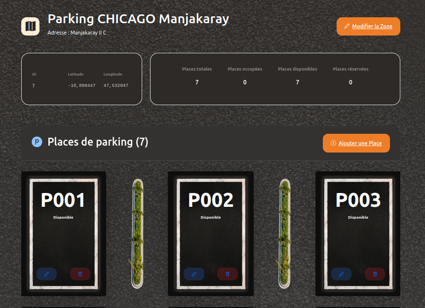
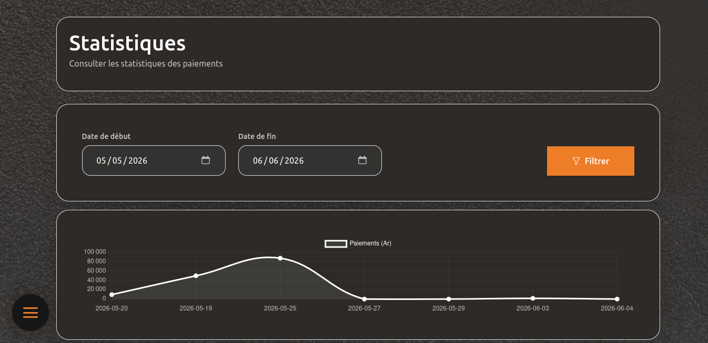

# ParkaApp

**La plateforme SaaS de gestion intelligente de parkings**


 Transformez vos terrains en sources de revenus optimisées grâce à une solution digitale complète, moderne et adaptée au contexte malgache.

------

## ✨ À propos du projet

**ParkaApp** est une plateforme web conçue pour simplifier et optimiser la gestion des espaces de stationnement. Elle permet aux propriétaires privés, entreprises et gestionnaires de parkings de digitaliser entièrement leurs opérations : suivi en temps réel, facturation automatisée, tableaux de bord analytiques et traçabilité complète.

**Positionnement** : Solution SaaS locale, scalable et abordable pour Madagascar et les marchés émergents.

------

## 🎯 Fonctionnalités principales

- **Gestion des Zones** — Création et supervision multi-sites avec géolocalisation
- **Gestion des Places** — Statut en temps réel (Disponible / Occupée / Réservée) et codes uniques
- **Gestion des Clients** — Profils véhicules, historiques et abonnements
- **Occupations** — Enregistrement entrée/sortie automatique avec calcul de durée
- **Paiements & Tarification** — Modèles horaires, journaliers et mensuels flexibles
- **Tableau de Bord** — Statistiques, revenus, taux d’occupation et rapports exportables
- **Recherche & Filtres** — Multi-critères avancé sur toutes les données

------

## 🛠️ Stack Technique

| Couche              | Technologie                       | Version |
| ------------------- | --------------------------------- | ------- |
| **Backend**         | ASP.NET Core                      | 10.0    |
| **ORM**             | Entity Framework Core             | 10.0.8  |
| **Base de données** | SQLite (évolutif vers PostgreSQL) | -       |
| **Frontend**        | Razor Pages + Tailwind CSS        | -       |
| **UI**              | Bootstrap Icons + Vanilla JS      | -       |

**Architecture** : MVC + Repository Pattern + Dependency Injection

------

## 📸 Aperçu


 


------

## 🚀 Installation & Démarrage

### Prérequis

- [.NET SDK 10](https://dotnet.microsoft.com/download)
- Git

### Étapes

```bash
# Cloner le repository
git clone https://github.com/parkaapp/parkaapp.git
cd parkaapp

# Restaurer les packages
dotnet restore

# Appliquer les migrations base de données
dotnet ef database update

# Lancer l'application
dotnet run
```

L’application sera accessible à l’adresse : `https://localhost:5001` (ou `http://localhost:5000`)

------

## 📁 Structure du projet

```
ParkaApp/
├── Controllers/          # Contrôleurs MVC
├── Models/               # Entités et ViewModels
├── Repositories/         # Couche d’abstraction données
├── Views/                # Pages Razor
├── wwwroot/              # Assets statiques (CSS, JS, images)
├── Data/                 # DbContext et Migrations
└── Program.cs
```

------

## 🛣️ Roadmap

- **Court terme** : Export PDF, notifications, intégration paiements locaux (Orange Money, Airtel)
- **Moyen terme** : Application mobile + QR Code, multi-tenancy
- **Long terme** : Tarification dynamique IA, portail client, scaling cloud

------

## 🤝 Contribution

Les contributions sont les bienvenues !
 Forkez le projet, créez une branche feature et soumettez une Pull Request.

Voir le fichier [CONTRIBUTING.md](CONTRIBUTING.md) pour plus de détails.

------

## 📄 Licence

Ce projet est sous licence **MIT**. Voir le fichier [LICENSE](LICENSE) pour plus d’informations.

------

## 📞 Contact & Support

- **Site web** : [www.ronhyraktos.me](https://www.ronhyraktos.me)
- **Email** : [ronhyrakotondrafara08@gmail.com](mailto:ronhyrakotondrafara08@gmail.com)

------

**Made with ❤️ for Madagascar**
